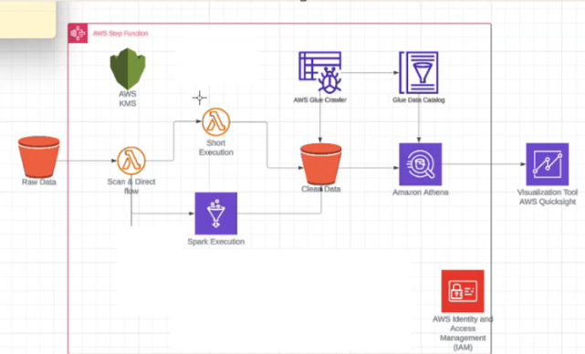

# AWS Data Pipeline Project

This project implements a data pipeline using AWS services such as AWS Step Functions, AWS Glue, Amazon Athena, and AWS QuickSight to process and visualize data.

## Architecture Diagram

## Components
- **AWS Lambda**: Serverless functions for processing.
- **AWS Glue**: Data catalog and ETL jobs.
- **Amazon Athena**: Querying data stored in S3.
- **AWS QuickSight**: Data visualization tool.

## Setup Instructions
